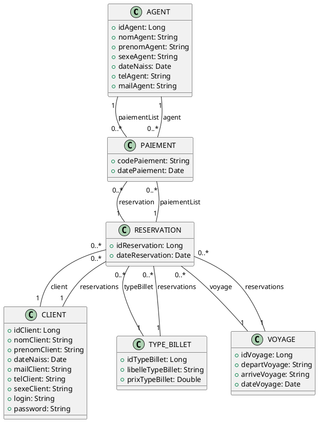

# Voyage Reservation System - Backend

## Project Overview

This project is a Spring Boot backend application for a voyage (trip) reservation system. It provides APIs for managing entities such as clients, voyages, reservations, ticket types, agents, and payments. The system is designed to be consumed by a frontend application, for example, one built with Angular.

---

## Entities

This section describes the data models (entities) used in the application.

### 1. AGENT
Represents an agent in the system.

**Attributes:**
*   `idAgent` (Long, Primary Key, Auto-generated)
*   `nomAgent` (String, Not Null, Max Length 75)
*   `prenomAgent` (String, Max Length 75)
*   `sexeAgent` (String, Not Null, Max Length 1)
*   `dateNaiss` (Date, Not Null, Format: "dd/mm/yyyy")
*   `telAgent` (String, Not Null, Max Length 20)
*   `mailAgent` (String, Not Null, Max Length 20)

**Relationships:**
*   **PAIEMENT**: One-to-Many (An AGENT can be associated with multiple PAIEMENTs). Mapped by `agent` in `PAIEMENT`.

### 2. CLIENT
Represents a client using the system.

**Attributes:**
*   `idClient` (Long, Primary Key, Auto-generated)
*   `nomClient` (String, Not Null, Max Length 100)
*   `prenomClient` (String, Not Null, Max Length 100)
*   `dateNaiss` (Date, Not Null, Format: "dd/mm/yyyy")
*   `mailClient` (String, Not Null, Max Length 100)
*   `telClient` (String, Not Null, Max Length 50)
*   `sexeClient` (String, Not Null)
*   `login` (String, Not Null, Max Length 100)
*   `password` (String, Not Null, Max Length 50)

**Relationships:**
*   **RESERVATION**: One-to-Many (A CLIENT can have multiple RESERVATIONs). Mapped by `client` in `RESERVATION`.

### 3. PAIEMENT
Represents a payment transaction.

**Attributes:**
*   `codePaiement` (String, Primary Key, Not Null, Max Length 10)
*   `datePaiement` (Date, Not Null, Format: "yyyy-MM-dd")

**Relationships:**
*   **RESERVATION**: Many-to-One (A PAIEMENT belongs to one RESERVATION). Join column `reservation`.
*   **AGENT**: Many-to-One (A PAIEMENT is processed by one AGENT). Join column `agent`.

### 4. RESERVATION
Represents a reservation made by a client for a voyage.

**Attributes:**
*   `idReservation` (Long, Primary Key, Auto-generated)
*   `dateReservation` (Date, Format: "yyyy-MM-dd")

**Relationships:**
*   **CLIENT**: Many-to-One (A RESERVATION is made by one CLIENT). Join column `client_id`.
*   **VOYAGE**: Many-to-One (A RESERVATION is for one VOYAGE). Join column `voyage_id`.
*   **TYPE_BILLET**: Many-to-One (A RESERVATION has one TYPE_BILLET). Join column `type_billet_id`.
*   **PAIEMENT**: One-to-Many (A RESERVATION can have multiple PAIEMENTs). *Note: This relationship should be mapped by `reservation` in the `PAIEMENT` entity. The `RESERVATION.paiementList` field should have `mappedBy = "reservation"`.*

### 5. TYPE_BILLET
Represents the type of a ticket (e.g., class, price).

**Attributes:**
*   `idTypeBillet` (Long, Primary Key, Auto-generated)
*   `libelleTypeBillet` (String, Not Null)
*   `prixTypeBillet` (Double, Not Null)

**Relationships:**
*   **RESERVATION**: One-to-Many (A TYPE_BILLET can be associated with multiple RESERVATIONs). Mapped by `typeBillet` in `RESERVATION`.

### 6. VOYAGE
Represents a voyage or trip.

**Attributes:**
*   `idVoyage` (Long, Primary Key, Auto-generated)
*   `departVoyage` (String, Not Null, Max Length 100)
*   `arriveVoyage` (String, Not Null, Max Length 100)
*   `dateVoyage` (Date, Not Null, Format: "yyyy-MM-dd")

**Relationships:**
*   **RESERVATION**: One-to-Many (A VOYAGE can have multiple RESERVATIONs). Mapped by `voyage` in `RESERVATION`.

---

## Entity Relationship Diagram (PlantUML)

The following is a class diagram representing the entities and their relationships in PlantUML format. You can render this diagram using PlantUML tools (e.g., online renderers like [PlantText](https://www.planttext.com/), or IDE plugins).



---

## API Endpoints

This section lists the available API endpoints.
Base Path Prefix for all controllers: `/tg/voyage_pro/reservation/auth`
CORS: Enabled for all origins (`*`) for most controllers.

**Potential Issues/Observations from API Analysis:**
*   **Inconsistent Response Types**: Some endpoints return direct objects (e.g., `RESERVATION` in `ReservationController.create`), while others use `ResponseEntity<?>`. Using `ResponseEntity` consistently is generally better practice.
*   **Unconventional HTTP Method**: `ReservationController` uses `GET /update`. Updates should typically be done using `PUT` or `PATCH`. A `GET` request with a body is also unusual and may not work as expected with all HTTP clients. The ID of the reservation to update is also missing from this endpoint's path.
*   **DTO vs. Entity Usage**: Controllers sometimes accept or return Entities (e.g., `CLIENT` in `ClientController.create`) and sometimes DTOs. A consistent DTO-based approach for API contracts is often preferred.

### 1. ClientController
Base Path: `/tg/voyage_pro/reservation/auth/client`

*   **`POST /create`**
    *   **Description**: Creates a new client.
    *   **Request Method**: `POST`
    *   **Request Body**: `CLIENT` object (JSON)
    *   **Response**: `CLIENT` object (JSON), HTTP 200
*   **`GET /getAll`**
    *   **Description**: Retrieves all clients.
    *   **Request Method**: `GET`
    *   **Response**: `List<ClientDTO>` (JSON), HTTP 200
*   **`GET /get/{idClient}`**
    *   **Description**: Retrieves a specific client by ID.
    *   **Request Method**: `GET`
    *   **Path Variable**: `idClient` (Long)
    *   **Response**: `ClientDTO` (JSON), HTTP 302 (Found)
*   **`PUT /update/{idClient}`**
    *   **Description**: Updates an existing client.
    *   **Request Method**: `PUT`
    *   **Path Variable**: `idClient` (Long)
    *   **Request Body**: `ClientDTO` object (JSON)
    *   **Response**: `ClientDTO` (JSON), HTTP 200
*   **`DELETE /delete/{idClient}`**
    *   **Description**: Deletes a client by ID.
    *   **Request Method**: `DELETE`
    *   **Path Variable**: `idClient` (Long)
    *   **Response**: Implementation-specific (likely a status message), HTTP 200
*   **`PUT /search`**
    *   **Description**: Searches for clients based on criteria.
    *   **Request Method**: `PUT`
    *   **Request Body**: `ClientDTO` object (JSON) for search criteria.
    *   **Response**: `List<ClientDTO>` (JSON), HTTP 200
*   **`GET /refresh`**
    *   **Description**: Refreshes the client list (exact behavior depends on service implementation).
    *   **Request Method**: `GET`
    *   **Response**: `List<ClientDTO>` (JSON), HTTP 200

### 2. ReservationController
Base Path: `/tg/voyage_pro/reservation/auth/reservation`

*   **`POST /create`**
    *   **Description**: Creates a new reservation.
    *   **Request Method**: `POST`
    *   **Request Body**: `ReservationDTO` object (JSON)
    *   **Response**: `RESERVATION` object (JSON)
*   **`GET /all`**
    *   **Description**: Retrieves all reservations.
    *   **Request Method**: `GET`
    *   **Response**: `List<ReservationDTO>` (JSON)
*   **`GET /update`**
    *   **Description**: Updates a reservation. *(Potential Issue noted above)*
    *   **Request Method**: `GET`
    *   **Request Body**: `ReservationDTO` object (JSON)
    *   **Response**: `ReservationDTO` (JSON)
*   **`DELETE /delete/{id}`**
    *   **Description**: Deletes a reservation by ID.
    *   **Request Method**: `DELETE`
    *   **Path Variable**: `id` (Long)
    *   **Response**: `boolean`

### 3. TypeBilletcontroller
Base Path: `/tg/voyage_pro/reservation/auth/ticket`

*   **`POST /create`**
    *   **Description**: Creates a new ticket type.
    *   **Request Method**: `POST`
    *   **Request Body**: `TYPE_BILLET` object (JSON)
    *   **Response**: `TYPE_BILLET` object (JSON)
*   **`GET /getAll`**
    *   **Description**: Retrieves all ticket types.
    *   **Request Method**: `GET`
    *   **Response**: `List<TYPE_BILLET>` (JSON)
*   **`GET /get/{id}`**
    *   **Description**: Retrieves a specific ticket type by ID.
    *   **Request Method**: `GET`
    *   **Path Variable**: `id` (Long)
    *   **Response**: `TypeBilletDTO` (JSON)
*   **`PUT /update/{idType}`**
    *   **Description**: Updates an existing ticket type.
    *   **Request Method**: `PUT`
    *   **Path Variable**: `idType` (Long)
    *   **Request Body**: `TypeBilletDTO` object (JSON)
    *   **Response**: `TypeBilletDTO` (JSON)
*   **`DELETE /delete/{id}`**
    *   **Description**: Deletes a ticket type by ID.
    *   **Request Method**: `DELETE`
    *   **Path Variable**: `id` (Long)
    *   **Response**: `boolean`

### 4. VoyageController
Base Path: `/tg/voyage_pro/reservation/auth/voyage`

*   **`POST /create`**
    *   **Description**: Creates a new voyage.
    *   **Request Method**: `POST`
    *   **Request Body**: `VoyageDTO` object (JSON)
    *   **Response**: `VOYAGE` or `VoyageDTO` object (JSON), HTTP 201 (Created)
*   **`GET /getAll`**
    *   **Description**: Retrieves all voyages.
    *   **Request Method**: `GET`
    *   **Response**: `List<VoyageDTO>` (JSON), HTTP 200
*   **`GET /get/{idVoyage}`**
    *   **Description**: Retrieves a specific voyage by ID.
    *   **Request Method**: `GET`
    *   **Path Variable**: `idVoyage` (Long)
    *   **Response**: `VOYAGE` object (JSON), HTTP 302 (Found)
*   **`DELETE /delete/{idVoyage}`**
    *   **Description**: Deletes a voyage by ID.
    *   **Request Method**: `DELETE`
    *   **Path Variable**: `idVoyage` (Long)
    *   **Response**: Implementation-specific (likely a status message), HTTP 200
*   **`PUT /update/{idVoyage}`**
    *   **Description**: Updates an existing voyage.
    *   **Request Method**: `PUT`
    *   **Path Variable**: `idVoyage` (Long)
    *   **Request Body**: `VoyageDTO` object (JSON)
    *   **Response**: `VOYAGE` or `VoyageDTO` object (JSON), HTTP 200

---

# Angular Backend Integration Guide

This guide provides instructions and examples for connecting an Angular application to the project's backend APIs.

## 1. Setting up Angular Services with HttpClientModule

To communicate with backend APIs, Angular uses the `HttpClient` service. You need to import `HttpClientModule` into your main application module (usually `app.module.ts`).

**`app.module.ts`:**
```typescript
import { NgModule } from '@angular/core';
import { BrowserModule } from '@angular/platform-browser';
import { HttpClientModule } from '@angular/common/http'; // Import HttpClientModule

import { AppComponent } from './app.component';
// ... other imports

@NgModule({
  declarations: [
    AppComponent,
    // ... other components
  ],
  imports: [
    BrowserModule,
    HttpClientModule, // Add HttpClientModule here
    // ... other modules
  ],
  providers: [],
  bootstrap: [AppComponent]
})
export class AppModule { }
```

Now, you can create Angular services and inject `HttpClient` to make HTTP requests.

**Example Service Structure (`client.service.ts`):**
```typescript
import { Injectable } from '@angular/core';
import { HttpClient, HttpHeaders, HttpParams } from '@angular/common/http';
import { Observable, throwError } from 'rxjs';
import { catchError } from 'rxjs/operators';

// Define interfaces for your DTOs/Entities if desired (recommended)
export interface ClientDTO {
  idClient?: number; // Optional for creation
  nomClient: string;
  prenomClient: string;
  dateNaiss: string; // Or Date, handle conversion appropriately
  mailClient: string;
  telClient: string;
  sexeClient: string;
  login: string;
  password?: string; // Optional for updates/responses
  // Add any other relevant fields from ClientDTO
}

// Interface for the raw CLIENT entity if used for POST
export interface Client {
  idClient?: number;
  nomClient: string;
  prenomClient: string;
  dateNaiss: string;
  mailClient: string;
  telClient: string;
  sexeClient: string;
  login: string;
  password?: string; // Password might be required for creation
}


@Injectable({
  providedIn: 'root' // Service available application-wide
})
export class ClientService {
  private baseUrl = '/tg/voyage_pro/reservation/auth/client'; // Base URL from API documentation

  constructor(private http: HttpClient) { }

  // CRUD methods will go here
}
```

## 2. Example CRUD Operations

Here are examples for `CLIENT` and `VOYAGE` entities. Remember to define corresponding DTO interfaces (e.g., `ClientDTO`, `VoyageDTO`) in your Angular application for type safety.

### Client Service (`client.service.ts`)

```typescript
import { Injectable } from '@angular/core';
import { HttpClient, HttpHeaders, HttpParams } from '@angular/common/http';
import { Observable, throwError } from 'rxjs';
import { catchError } from 'rxjs/operators';

// Define interfaces for your DTOs/Entities
export interface ClientDTO {
  idClient?: number;
  nomClient: string;
  prenomClient: string;
  dateNaiss: string;
  mailClient: string;
  telClient: string;
  sexeClient: string;
  login: string;
  password?: string;
}

// Raw CLIENT entity as expected by POST /create
export interface Client {
  idClient?: number;
  nomClient: string;
  prenomClient: string;
  dateNaiss: string;
  mailClient: string;
  telClient: string;
  sexeClient: string;
  login: string;
  password?: string;
}

@Injectable({
  providedIn: 'root'
})
export class ClientService {
  private baseUrl = '/tg/voyage_pro/reservation/auth/client';

  // Standard HTTP options
  private httpOptions = {
    headers: new HttpHeaders({
      'Content-Type': 'application/json'
    })
  };

  constructor(private http: HttpClient) { }

  // POST /create (expects full CLIENT object)
  createClient(clientData: Client): Observable<Client> {
    return this.http.post<Client>(`${this.baseUrl}/create`, clientData, this.httpOptions)
      .pipe(
        catchError(this.handleError)
      );
  }

  // GET /getAll
  getAllClients(): Observable<ClientDTO[]> {
    return this.http.get<ClientDTO[]>(`${this.baseUrl}/getAll`)
      .pipe(
        catchError(this.handleError)
      );
  }

  // GET /get/{idClient}
  getClientById(idClient: number): Observable<ClientDTO> {
    return this.http.get<ClientDTO>(`${this.baseUrl}/get/${idClient}`)
      .pipe(
        catchError(this.handleError)
      );
  }

  // PUT /update/{idClient} (expects ClientDTO)
  updateClient(idClient: number, clientData: ClientDTO): Observable<ClientDTO> {
    return this.http.put<ClientDTO>(`${this.baseUrl}/update/${idClient}`, clientData, this.httpOptions)
      .pipe(
        catchError(this.handleError)
      );
  }

  // DELETE /delete/{idClient}
  deleteClient(idClient: number): Observable<any> { // Response type might vary (e.g., boolean, status message)
    return this.http.delete<any>(`${this.baseUrl}/delete/${idClient}`)
      .pipe(
        catchError(this.handleError)
      );
  }

  // PUT /search (expects ClientDTO for criteria)
  searchClients(searchCriteria: ClientDTO): Observable<ClientDTO[]> {
    return this.http.put<ClientDTO[]>(`${this.baseUrl}/search`, searchCriteria, this.httpOptions)
      .pipe(
        catchError(this.handleError)
      );
  }

  // Basic error handler (see section 4 for more details)
  private handleError(error: any) {
    console.error('An API error occurred:', error);
    // Further error handling logic (e.g., user-friendly messages)
    return throwError(() => new Error('Something bad happened; please try again later.'));
  }
}
```

### Voyage Service (`voyage.service.ts`)

```typescript
import { Injectable } from '@angular/core';
import { HttpClient, HttpHeaders } from '@angular/common/http';
import { Observable, throwError } from 'rxjs';
import { catchError } from 'rxjs/operators';

export interface VoyageDTO {
  idVoyage?: number;
  departVoyage: string;
  arriveVoyage: string;
  dateVoyage: string; // Or Date, handle conversion
}

@Injectable({
  providedIn: 'root'
})
export class VoyageService {
  private baseUrl = '/tg/voyage_pro/reservation/auth/voyage';

  private httpOptions = {
    headers: new HttpHeaders({
      'Content-Type': 'application/json'
    })
  };

  constructor(private http: HttpClient) { }

  // POST /create
  createVoyage(voyageData: VoyageDTO): Observable<VoyageDTO> { // Assuming response is VoyageDTO
    return this.http.post<VoyageDTO>(`${this.baseUrl}/create`, voyageData, this.httpOptions)
      .pipe(
        catchError(this.handleError)
      );
  }

  // GET /getAll
  getAllVoyages(): Observable<VoyageDTO[]> {
    return this.http.get<VoyageDTO[]>(`${this.baseUrl}/getAll`)
      .pipe(
        catchError(this.handleError)
      );
  }

  // GET /get/{idVoyage}
  getVoyageById(idVoyage: number): Observable<VoyageDTO> { // Assuming response is VoyageDTO, though API doc says VOYAGE
    return this.http.get<VoyageDTO>(`${this.baseUrl}/get/${idVoyage}`)
      .pipe(
        catchError(this.handleError)
      );
  }

  // PUT /update/{idVoyage}
  updateVoyage(idVoyage: number, voyageData: VoyageDTO): Observable<VoyageDTO> {
    return this.http.put<VoyageDTO>(`${this.baseUrl}/update/${idVoyage}`, voyageData, this.httpOptions)
      .pipe(
        catchError(this.handleError)
      );
  }

  // DELETE /delete/{idVoyage}
  deleteVoyage(idVoyage: number): Observable<any> {
    return this.http.delete<any>(`${this.baseUrl}/delete/${idVoyage}`)
      .pipe(
        catchError(this.handleError)
      );
  }

  private handleError(error: any) {
    console.error('An API error occurred:', error);
    return throwError(() => new Error('Error in VoyageService; please try again.'));
  }
}
```

## 3. Handling Request Elements

### Request Headers
Headers like `Content-Type` are often required, especially for `POST` and `PUT` requests sending JSON data.

```typescript
const httpOptions = {
  headers: new HttpHeaders({
    'Content-Type': 'application/json',
    // 'Authorization': 'Bearer YOUR_TOKEN' // Example for auth tokens
  })
};

// Use it in a request:
// this.http.post(url, data, httpOptions)
```

### Path Variables
Path variables are part of the URL. Use JavaScript template literals to build the URL.

```typescript
// For GET /get/{idClient}
const idClient = 123;
this.http.get<ClientDTO>(`${this.baseUrl}/get/${idClient}`);

// For PUT /update/{idClient}
// this.http.put<ClientDTO>(`${this.baseUrl}/update/${idClient}`, clientData, httpOptions);
```

### Query Parameters
Use `HttpParams` to add URL query parameters.

```typescript
import { HttpParams } from '@angular/common/http';

// Example: GET /api/items?orderBy=name&limit=10
let params = new HttpParams();
params = params.append('orderBy', 'name');
params = params.append('limit', '10');

// this.http.get(url, { params: params });
```
*(Note: The current API specification in `api_and_entity_summary.md` does not show endpoints that explicitly use query parameters, but this is how you would handle them.)*

### Request Bodies
For `POST` and `PUT` requests, the data (usually a JavaScript object matching the expected DTO/Entity structure) is passed as the second argument to `http.post()` or `http.put()`. `HttpClient` automatically converts it to JSON if `Content-Type` is `application/json`.

```typescript
// const clientData: Client = { /* ... */ };
// this.http.post<Client>(`${this.baseUrl}/create`, clientData, this.httpOptions);

// const voyageData: VoyageDTO = { /* ... */ };
// this.http.put<VoyageDTO>(`${this.baseUrl}/update/${idVoyage}`, voyageData, this.httpOptions);
```

## 4. Basic Error Handling in Angular Services

Use the `catchError` operator from RxJS to handle errors in your service calls.

```typescript
import { throwError } from 'rxjs';
import { catchError } from 'rxjs/operators';

// ... inside your service method
return this.http.get<ClientDTO[]>(`${this.baseUrl}/getAll`)
  .pipe(
    catchError(this.handleError) // Reference to a private method
  );

// ... private handleError method in the service
private handleError(error: HttpErrorResponse) {
  if (error.error instanceof ErrorEvent) {
    // A client-side or network error occurred. Handle it accordingly.
    console.error('An error occurred:', error.error.message);
  } else {
    // The backend returned an unsuccessful response code.
    // The response body may contain clues as to what went wrong.
    console.error(
      `Backend returned code ${error.status}, ` +
      `body was: ${JSON.stringify(error.error)}`);
  }
  // Return an observable with a user-facing error message.
  return throwError(() => new Error('Something bad happened; please try again later.'));
}
```
You can then subscribe to these services in your components and handle the errors for the user (e.g., display a message).

## 5. CORS (Cross-Origin Resource Sharing)

The backend controllers are annotated with `@CrossOrigin("*")`. This configuration tells the browser to allow requests from any origin (domain, port, or protocol).

**Implications for Angular Development:**
*   **Simplified Development**: For simple cases during local development (e.g., Angular app on `http://localhost:4200` and backend on `http://localhost:8080`), you generally **do not need to set up an Angular proxy** (`proxy.conf.json`) to bypass browser's same-origin policy. The backend already permits the cross-origin requests.
*   **Production**: While `*` is permissive, for production environments, it's often recommended to restrict the allowed origins to the specific domain where your Angular application is hosted for better security. This would be a backend configuration change.
*   **Cookies/Authentication**: If your application uses cookie-based authentication or sessions, `@CrossOrigin("*")` might not be sufficient, and you might need `allowCredentials = "true"` on the backend along with `withCredentials: true` in your Angular HTTP requests. However, for token-based authentication (e.g., JWT in Authorization header), this is less of an issue.

This guide should provide a solid starting point for integrating your Angular frontend with the provided backend APIs. Remember to adapt DTO/Entity interfaces and service methods based on the exact requirements of your application.

Joël et Ron
