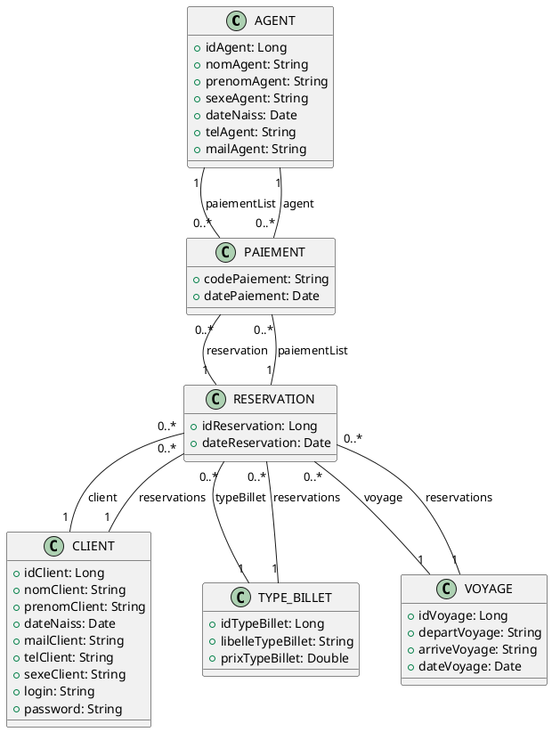

# Voyage Reservation System - Backend

## Aperçu du Projet

Ce projet est une application backend Spring Boot pour un système de réservation de voyages. Il fournit des APIs pour gérer des entités telles que les clients, les voyages, les réservations, les types de billets, les agents et les paiements. Le système est conçu pour être consommé par une application frontend, par exemple, une application construite avec Angular.

---

## Entités

Cette section décrit les modèles de données (entités) utilisés dans l'application.

### 1. AGENT
Représente un agent dans le système.

**Attributes:**
*   `idAgent` (Long, Primary Key, Auto-generated)
*   `nomAgent` (String, Not Null, Max Length 75)
*   `prenomAgent` (String, Max Length 75)
*   `sexeAgent` (String, Not Null, Max Length 1)
*   `dateNaiss` (Date, Not Null, Format: "dd/mm/yyyy")
*   `telAgent` (String, Not Null, Max Length 20)
*   `mailAgent` (String, Not Null, Max Length 20)

**Relationships:**
*   **PAIEMENT**: One-to-Many (Un AGENT peut être associé à plusieurs PAIEMENTs). Mappé par `agent` dans `PAIEMENT`.

### 2. CLIENT
Représente un client utilisant le système.

**Attributes:**
*   `idClient` (Long, Primary Key, Auto-generated)
*   `nomClient` (String, Not Null, Max Length 100)
*   `prenomClient` (String, Not Null, Max Length 100)
*   `dateNaiss` (Date, Not Null, Format: "dd/mm/yyyy")
*   `mailClient` (String, Not Null, Max Length 100)
*   `telClient` (String, Not Null, Max Length 50)
*   `sexeClient` (String, Not Null)
*   `login` (String, Not Null, Max Length 100)
*   `password` (String, Not Null, Max Length 50)

**Relationships:**
*   **RESERVATION**: One-to-Many (Un CLIENT peut avoir plusieurs RESERVATIONs). Mappé par `client` dans `RESERVATION`.

### 3. PAIEMENT
Représente une transaction de paiement.

**Attributes:**
*   `codePaiement` (String, Primary Key, Not Null, Max Length 10)
*   `datePaiement` (Date, Not Null, Format: "yyyy-MM-dd")

**Relationships:**
*   **RESERVATION**: Many-to-One (Un PAIEMENT appartient à une RESERVATION). Colonne de jointure `reservation`.
*   **AGENT**: Many-to-One (Un PAIEMENT est traité par un AGENT). Colonne de jointure `agent`.

### 4. RESERVATION
Représente une réservation effectuée par un client pour un voyage.

**Attributes:**
*   `idReservation` (Long, Primary Key, Auto-generated)
*   `dateReservation` (Date, Format: "yyyy-MM-dd")

**Relationships:**
*   **CLIENT**: Many-to-One (Une RESERVATION est effectuée par un CLIENT). Colonne de jointure `client_id`.
*   **VOYAGE**: Many-to-One (Une RESERVATION concerne un VOYAGE). Colonne de jointure `voyage_id`.
*   **TYPE_BILLET**: Many-to-One (Une RESERVATION a un TYPE_BILLET). Colonne de jointure `type_billet_id`.
*   **PAIEMENT**: One-to-Many (Une RESERVATION peut avoir plusieurs PAIEMENTs). *Note: Cette relation devrait être mappée par `reservation` dans l'entité `PAIEMENT`. Le champ `RESERVATION.paiementList` devrait avoir `mappedBy = "reservation"`.*

### 5. TYPE_BILLET
Représente le type d'un billet (par exemple, classe, prix).

**Attributes:**
*   `idTypeBillet` (Long, Primary Key, Auto-generated)
*   `libelleTypeBillet` (String, Not Null)
*   `prixTypeBillet` (Double, Not Null)

**Relationships:**
*   **RESERVATION**: One-to-Many (Un TYPE_BILLET peut être associé à plusieurs RESERVATIONs). Mappé par `typeBillet` dans `RESERVATION`.

### 6. VOYAGE
Représente un voyage ou un trajet.

**Attributes:**
*   `idVoyage` (Long, Primary Key, Auto-generated)
*   `departVoyage` (String, Not Null, Max Length 100)
*   `arriveVoyage` (String, Not Null, Max Length 100)
*   `dateVoyage` (Date, Not Null, Format: "yyyy-MM-dd")

**Relationships:**
*   **RESERVATION**: One-to-Many (Un VOYAGE peut avoir plusieurs RESERVATIONs). Mappé par `voyage` dans `RESERVATION`.

---

## Diagramme de Relation des Entités (PlantUML)

Ce qui suit est un diagramme de classes représentant les entités et leurs relations au format PlantUML. Vous pouvez générer ce diagramme en utilisant des outils PlantUML (par exemple, des moteurs de rendu en ligne comme [PlantText](https://www.planttext.com/), ou des plugins IDE).



---

## Points d'accès API (API Endpoints)

Cette section liste les points d'accès API disponibles.
Préfixe de chemin de base pour tous les contrôleurs : `/tg/voyage_pro/reservation/auth`
CORS : Activé pour toutes les origines (`*`) pour la plupart des contrôleurs.

**Problèmes Potentiels/Observations de l'Analyse des API:**
*   **Types de Réponse Incohérents**: Certains points d'accès retournent des objets directs (par ex., `RESERVATION` dans `ReservationController.create`), tandis que d'autres utilisent `ResponseEntity<?>`. Utiliser `ResponseEntity` de manière cohérente est généralement une meilleure pratique.
*   **Méthode HTTP Non Conventionnelle**: `ReservationController` utilise `GET /update`. Les mises à jour devraient typiquement être effectuées en utilisant `PUT` ou `PATCH`. Une requête `GET` avec un corps de requête est également inhabituelle et pourrait ne pas fonctionner comme attendu avec tous les clients HTTP. L'ID de la réservation à mettre à jour manque également dans le chemin de ce point d'accès.
*   **Utilisation DTO vs. Entité**: Les contrôleurs acceptent ou retournent parfois des Entités (par ex., `CLIENT` dans `ClientController.create`) et parfois des DTOs. Une approche cohérente basée sur les DTO pour les contrats API est souvent préférée.

### 1. ClientController
Chemin de base : `/tg/voyage_pro/reservation/auth/client`

*   **`POST /create`**
    *   **Description**: Crée un nouveau client.
    *   **Request Method**: `POST`
    *   **Request Body**: Objet `CLIENT` (JSON)
    *   **Response**: Objet `CLIENT` (JSON), HTTP 200
*   **`GET /getAll`**
    *   **Description**: Récupère tous les clients.
    *   **Request Method**: `GET`
    *   **Response**: `List<ClientDTO>` (JSON), HTTP 200
*   **`GET /get/{idClient}`**
    *   **Description**: Récupère un client spécifique par ID.
    *   **Request Method**: `GET`
    *   **Path Variable**: `idClient` (Long)
    *   **Response**: `ClientDTO` (JSON), HTTP 302 (Found)
*   **`PUT /update/{idClient}`**
    *   **Description**: Met à jour un client existant.
    *   **Request Method**: `PUT`
    *   **Path Variable**: `idClient` (Long)
    *   **Request Body**: Objet `ClientDTO` (JSON)
    *   **Response**: `ClientDTO` (JSON), HTTP 200
*   **`DELETE /delete/{idClient}`**
    *   **Description**: Supprime un client par ID.
    *   **Request Method**: `DELETE`
    *   **Path Variable**: `idClient` (Long)
    *   **Response**: Spécifique à l'implémentation (probablement un message de statut), HTTP 200
*   **`PUT /search`**
    *   **Description**: Recherche des clients selon des critères.
    *   **Request Method**: `PUT`
    *   **Request Body**: Objet `ClientDTO` (JSON) pour les critères de recherche.
    *   **Response**: `List<ClientDTO>` (JSON), HTTP 200
*   **`GET /refresh`**
    *   **Description**: Rafraîchit la liste des clients (le comportement exact dépend de l'implémentation du service).
    *   **Request Method**: `GET`
    *   **Response**: `List<ClientDTO>` (JSON), HTTP 200

### 2. ReservationController
Chemin de base : `/tg/voyage_pro/reservation/auth/reservation`

*   **`POST /create`**
    *   **Description**: Crée une nouvelle réservation.
    *   **Request Method**: `POST`
    *   **Request Body**: Objet `ReservationDTO` (JSON)
    *   **Response**: Objet `RESERVATION` (JSON)
*   **`GET /all`**
    *   **Description**: Récupère toutes les réservations.
    *   **Request Method**: `GET`
    *   **Response**: `List<ReservationDTO>` (JSON)
*   **`GET /update`**
    *   **Description**: Met à jour une réservation. *(Problème potentiel noté ci-dessus)*
    *   **Request Method**: `GET`
    *   **Request Body**: Objet `ReservationDTO` (JSON)
    *   **Response**: `ReservationDTO` (JSON)
*   **`DELETE /delete/{id}`**
    *   **Description**: Supprime une réservation par ID.
    *   **Request Method**: `DELETE`
    *   **Path Variable**: `id` (Long)
    *   **Response**: `boolean`

### 3. TypeBilletcontroller
Chemin de base : `/tg/voyage_pro/reservation/auth/ticket`

*   **`POST /create`**
    *   **Description**: Crée un nouveau type de billet.
    *   **Request Method**: `POST`
    *   **Request Body**: Objet `TYPE_BILLET` (JSON)
    *   **Response**: Objet `TYPE_BILLET` (JSON)
*   **`GET /getAll`**
    *   **Description**: Récupère tous les types de billets.
    *   **Request Method**: `GET`
    *   **Response**: `List<TYPE_BILLET>` (JSON)
*   **`GET /get/{id}`**
    *   **Description**: Récupère un type de billet spécifique par ID.
    *   **Request Method**: `GET`
    *   **Path Variable**: `id` (Long)
    *   **Response**: `TypeBilletDTO` (JSON)
*   **`PUT /update/{idType}`**
    *   **Description**: Met à jour un type de billet existant.
    *   **Request Method**: `PUT`
    *   **Path Variable**: `idType` (Long)
    *   **Request Body**: Objet `TypeBilletDTO` (JSON)
    *   **Response**: `TypeBilletDTO` (JSON)
*   **`DELETE /delete/{id}`**
    *   **Description**: Supprime un type de billet par ID.
    *   **Request Method**: `DELETE`
    *   **Path Variable**: `id` (Long)
    *   **Response**: `boolean`

### 4. VoyageController
Chemin de base : `/tg/voyage_pro/reservation/auth/voyage`

*   **`POST /create`**
    *   **Description**: Crée un nouveau voyage.
    *   **Request Method**: `POST`
    *   **Request Body**: Objet `VoyageDTO` (JSON)
    *   **Response**: Objet `VOYAGE` ou `VoyageDTO` (JSON), HTTP 201 (Created)
*   **`GET /getAll`**
    *   **Description**: Récupère tous les voyages.
    *   **Request Method**: `GET`
    *   **Response**: `List<VoyageDTO>` (JSON), HTTP 200
*   **`GET /get/{idVoyage}`**
    *   **Description**: Récupère un voyage spécifique par ID.
    *   **Request Method**: `GET`
    *   **Path Variable**: `idVoyage` (Long)
    *   **Response**: Objet `VOYAGE` (JSON), HTTP 302 (Found)
*   **`DELETE /delete/{idVoyage}`**
    *   **Description**: Supprime un voyage par ID.
    *   **Request Method**: `DELETE`
    *   **Path Variable**: `idVoyage` (Long)
    *   **Response**: Spécifique à l'implémentation (probablement un message de statut), HTTP 200
*   **`PUT /update/{idVoyage}`**
    *   **Description**: Met à jour un voyage existant.
    *   **Request Method**: `PUT`
    *   **Path Variable**: `idVoyage` (Long)
    *   **Request Body**: Objet `VoyageDTO` (JSON)
    *   **Response**: Objet `VOYAGE` ou `VoyageDTO` (JSON), HTTP 200

---

# Guide d'Intégration Backend Angular

Ce guide fournit des instructions et des exemples pour connecter une application Angular aux APIs backend du projet.

## 1. Configuration des Services Angular avec HttpClientModule

Pour communiquer avec les APIs backend, Angular utilise le service `HttpClient`. Vous devez importer `HttpClientModule` dans votre module d'application principal (généralement `app.module.ts`).

**`app.module.ts`:**
```typescript
import { NgModule } from '@angular/core';
import { BrowserModule } from '@angular/platform-browser';
import { HttpClientModule } from '@angular/common/http'; // Import HttpClientModule

import { AppComponent } from './app.component';
// ... other imports

@NgModule({
  declarations: [
    AppComponent,
    // ... other components
  ],
  imports: [
    BrowserModule,
    HttpClientModule, // Add HttpClientModule here
    // ... other modules
  ],
  providers: [],
  bootstrap: [AppComponent]
})
export class AppModule { }
```

Maintenant, vous pouvez créer des services Angular et injecter `HttpClient` pour effectuer des requêtes HTTP.

**Structure d'Exemple de Service (`client.service.ts`):**
```typescript
import { Injectable } from '@angular/core';
import { HttpClient, HttpHeaders, HttpParams } from '@angular/common/http';
import { Observable, throwError } from 'rxjs';
import { catchError } from 'rxjs/operators';

// Define interfaces for your DTOs/Entities if desired (recommended)
export interface ClientDTO {
  idClient?: number; // Optional for creation
  nomClient: string;
  prenomClient: string;
  dateNaiss: string; // Or Date, handle conversion appropriately
  mailClient: string;
  telClient: string;
  sexeClient: string;
  login: string;
  password?: string; // Optional for updates/responses
  // Add any other relevant fields from ClientDTO
}

// Interface for the raw CLIENT entity if used for POST
export interface Client {
  idClient?: number;
  nomClient: string;
  prenomClient: string;
  dateNaiss: string;
  mailClient: string;
  telClient: string;
  sexeClient: string;
  login: string;
  password?: string; // Password might be required for creation
}


@Injectable({
  providedIn: 'root' // Service available application-wide
})
export class ClientService {
  private baseUrl = '/tg/voyage_pro/reservation/auth/client'; // Base URL from API documentation

  constructor(private http: HttpClient) { }

  // CRUD methods will go here
}
```

## 2. Exemples d'Opérations CRUD

Voici des exemples pour les entités `CLIENT` et `VOYAGE`. N'oubliez pas de définir les interfaces DTO correspondantes (par ex., `ClientDTO`, `VoyageDTO`) dans votre application Angular pour la sécurité des types.

### Client Service (`client.service.ts`)

```typescript
import { Injectable } from '@angular/core';
import { HttpClient, HttpHeaders, HttpParams } from '@angular/common/http';
import { Observable, throwError } from 'rxjs';
import { catchError } from 'rxjs/operators';

// Define interfaces for your DTOs/Entities
export interface ClientDTO {
  idClient?: number;
  nomClient: string;
  prenomClient: string;
  dateNaiss: string;
  mailClient: string;
  telClient: string;
  sexeClient: string;
  login: string;
  password?: string; 
}

// Raw CLIENT entity as expected by POST /create
export interface Client {
  idClient?: number;
  nomClient: string;
  prenomClient: string;
  dateNaiss: string; 
  mailClient: string;
  telClient: string;
  sexeClient: string;
  login: string;
  password?: string; 
}

@Injectable({
  providedIn: 'root'
})
export class ClientService {
  private baseUrl = '/tg/voyage_pro/reservation/auth/client'; 

  // Standard HTTP options
  private httpOptions = {
    headers: new HttpHeaders({
      'Content-Type': 'application/json'
    })
  };

  constructor(private http: HttpClient) { }

  // POST /create (expects full CLIENT object)
  createClient(clientData: Client): Observable<Client> {
    return this.http.post<Client>(`${this.baseUrl}/create`, clientData, this.httpOptions)
      .pipe(
        catchError(this.handleError)
      );
  }

  // GET /getAll
  getAllClients(): Observable<ClientDTO[]> {
    return this.http.get<ClientDTO[]>(`${this.baseUrl}/getAll`)
      .pipe(
        catchError(this.handleError)
      );
  }

  // GET /get/{idClient}
  getClientById(idClient: number): Observable<ClientDTO> {
    return this.http.get<ClientDTO>(`${this.baseUrl}/get/${idClient}`)
      .pipe(
        catchError(this.handleError)
      );
  }

  // PUT /update/{idClient} (expects ClientDTO)
  updateClient(idClient: number, clientData: ClientDTO): Observable<ClientDTO> {
    return this.http.put<ClientDTO>(`${this.baseUrl}/update/${idClient}`, clientData, this.httpOptions)
      .pipe(
        catchError(this.handleError)
      );
  }

  // DELETE /delete/{idClient}
  deleteClient(idClient: number): Observable<any> { // Response type might vary (e.g., boolean, status message)
    return this.http.delete<any>(`${this.baseUrl}/delete/${idClient}`)
      .pipe(
        catchError(this.handleError)
      );
  }
  
  // PUT /search (expects ClientDTO for criteria)
  searchClients(searchCriteria: ClientDTO): Observable<ClientDTO[]> {
    return this.http.put<ClientDTO[]>(`${this.baseUrl}/search`, searchCriteria, this.httpOptions)
      .pipe(
        catchError(this.handleError)
      );
  }

  // Basic error handler (see section 4 for more details)
  private handleError(error: any) {
    console.error('An API error occurred:', error);
    // Further error handling logic (e.g., user-friendly messages)
    return throwError(() => new Error('Something bad happened; please try again later.'));
  }
}
```

### Voyage Service (`voyage.service.ts`)

```typescript
import { Injectable } from '@angular/core';
import { HttpClient, HttpHeaders } from '@angular/common/http';
import { Observable, throwError } from 'rxjs';
import { catchError } from 'rxjs/operators';

export interface VoyageDTO {
  idVoyage?: number;
  departVoyage: string;
  arriveVoyage: string;
  dateVoyage: string; // Or Date, handle conversion
}

@Injectable({
  providedIn: 'root'
})
export class VoyageService {
  private baseUrl = '/tg/voyage_pro/reservation/auth/voyage';

  private httpOptions = {
    headers: new HttpHeaders({
      'Content-Type': 'application/json'
    })
  };

  constructor(private http: HttpClient) { }

  // POST /create
  createVoyage(voyageData: VoyageDTO): Observable<VoyageDTO> { // Assuming response is VoyageDTO
    return this.http.post<VoyageDTO>(`${this.baseUrl}/create`, voyageData, this.httpOptions)
      .pipe(
        catchError(this.handleError)
      );
  }

  // GET /getAll
  getAllVoyages(): Observable<VoyageDTO[]> {
    return this.http.get<VoyageDTO[]>(`${this.baseUrl}/getAll`)
      .pipe(
        catchError(this.handleError)
      );
  }

  // GET /get/{idVoyage}
  getVoyageById(idVoyage: number): Observable<VoyageDTO> { // Assuming response is VoyageDTO, though API doc says VOYAGE
    return this.http.get<VoyageDTO>(`${this.baseUrl}/get/${idVoyage}`)
      .pipe(
        catchError(this.handleError)
      );
  }

  // PUT /update/{idVoyage}
  updateVoyage(idVoyage: number, voyageData: VoyageDTO): Observable<VoyageDTO> {
    return this.http.put<VoyageDTO>(`${this.baseUrl}/update/${idVoyage}`, voyageData, this.httpOptions)
      .pipe(
        catchError(this.handleError)
      );
  }

  // DELETE /delete/{idVoyage}
  deleteVoyage(idVoyage: number): Observable<any> {
    return this.http.delete<any>(`${this.baseUrl}/delete/${idVoyage}`)
      .pipe(
        catchError(this.handleError)
      );
  }

  private handleError(error: any) {
    console.error('An API error occurred:', error);
    return throwError(() => new Error('Error in VoyageService; please try again.'));
  }
}
```

## 3. Gestion des Éléments de Requête

### En-têtes de Requête (Request Headers)
Les en-têtes comme `Content-Type` sont souvent requis, spécialement pour les requêtes `POST` et `PUT` envoyant des données JSON.

```typescript
const httpOptions = {
  headers: new HttpHeaders({
    'Content-Type': 'application/json',
    // 'Authorization': 'Bearer YOUR_TOKEN' // Example for auth tokens
  })
};

// Use it in a request:
// this.http.post(url, data, httpOptions)
```

### Variables de Chemin (Path Variables)
Les variables de chemin font partie de l'URL. Utilisez les littéraux de gabarit JavaScript pour construire l'URL.

```typescript
// For GET /get/{idClient}
const idClient = 123;
this.http.get<ClientDTO>(`${this.baseUrl}/get/${idClient}`);

// For PUT /update/{idClient}
// this.http.put<ClientDTO>(`${this.baseUrl}/update/${idClient}`, clientData, httpOptions);
```

### Paramètres de Requête (Query Parameters)
Utilisez `HttpParams` pour ajouter des paramètres de requête URL.

```typescript
import { HttpParams } from '@angular/common/http';

// Example: GET /api/items?orderBy=name&limit=10
let params = new HttpParams();
params = params.append('orderBy', 'name');
params = params.append('limit', '10');

// this.http.get(url, { params: params });
```
*(Note: La spécification API actuelle dans `api_and_entity_summary.md` ne montre pas de points d'accès utilisant explicitement des paramètres de requête, mais c'est ainsi que vous les géreriez.)*

### Corps de Requête (Request Bodies)
Pour les requêtes `POST` et `PUT`, les données (généralement un objet JavaScript correspondant à la structure DTO/Entité attendue) sont passées comme deuxième argument à `http.post()` ou `http.put()`. `HttpClient` les convertit automatiquement en JSON si `Content-Type` est `application/json`.

```typescript
// const clientData: Client = { /* ... */ };
// this.http.post<Client>(`${this.baseUrl}/create`, clientData, this.httpOptions);

// const voyageData: VoyageDTO = { /* ... */ };
// this.http.put<VoyageDTO>(`${this.baseUrl}/update/${idVoyage}`, voyageData, this.httpOptions);
```

## 4. Gestion Basique des Erreurs dans les Services Angular

Utilisez l'opérateur `catchError` de RxJS pour gérer les erreurs dans vos appels de service.

```typescript
import { throwError } from 'rxjs';
import { catchError } from 'rxjs/operators';

// ... inside your service method
return this.http.get<ClientDTO[]>(`${this.baseUrl}/getAll`)
  .pipe(
    catchError(this.handleError) // Reference to a private method
  );

// ... private handleError method in the service
private handleError(error: HttpErrorResponse) {
  if (error.error instanceof ErrorEvent) {
    // A client-side or network error occurred. Handle it accordingly.
    console.error('An error occurred:', error.error.message);
  } else {
    // The backend returned an unsuccessful response code.
    // The response body may contain clues as to what went wrong.
    console.error(
      `Backend returned code ${error.status}, ` +
      `body was: ${JSON.stringify(error.error)}`);
  }
  // Return an observable with a user-facing error message.
  return throwError(() => new Error('Something bad happened; please try again later.'));
}
```
Vous pouvez ensuite vous abonner à ces services dans vos composants et gérer les erreurs pour l'utilisateur (par exemple, afficher un message).

## 5. CORS (Cross-Origin Resource Sharing)

Les contrôleurs backend sont annotés avec `@CrossOrigin("*")`. Cette configuration indique au navigateur d'autoriser les requêtes de n'importe quelle origine (domaine, port ou protocole).

**Implications pour le Développement Angular:**
*   **Développement Simplifié**: Pour les cas simples pendant le développement local (par ex., application Angular sur `http://localhost:4200` et backend sur `http://localhost:8080`), vous n'avez généralement **pas besoin de configurer un proxy Angular** (`proxy.conf.json`) pour contourner la politique de même origine du navigateur. Le backend autorise déjà les requêtes cross-origin.
*   **Production**: Bien que `*` soit permissif, pour les environnements de production, il est souvent recommandé de restreindre les origines autorisées au domaine spécifique où votre application Angular est hébergée pour une meilleure sécurité. Ce serait un changement de configuration backend.
*   **Cookies/Authentification**: Si votre application utilise une authentification basée sur les cookies ou des sessions, `@CrossOrigin("*")` pourrait ne pas être suffisant, et vous pourriez avoir besoin de `allowCredentials = "true"` sur le backend ainsi que `withCredentials: true` dans vos requêtes HTTP Angular. Cependant, pour une authentification basée sur les jetons (par ex., JWT dans l'en-tête Authorization), ce problème est moins préoccupant.

Ce guide devrait fournir un point de départ solide pour intégrer votre frontend Angular avec les APIs backend fournies. N'oubliez pas d'adapter les interfaces DTO/Entité et les méthodes de service en fonction des exigences exactes de votre application.

Joël et Ron
